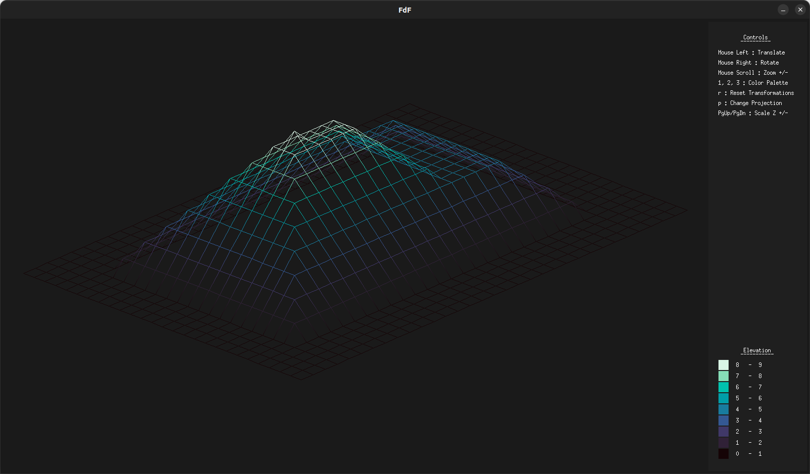
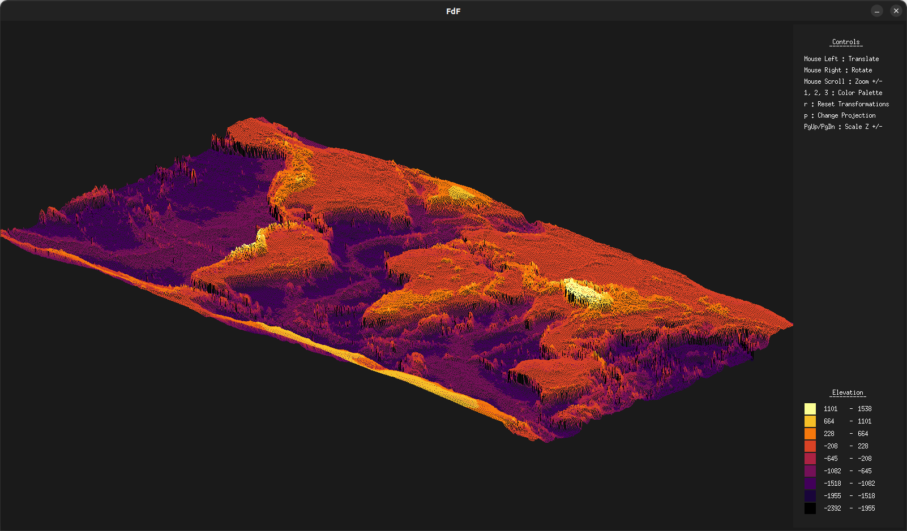
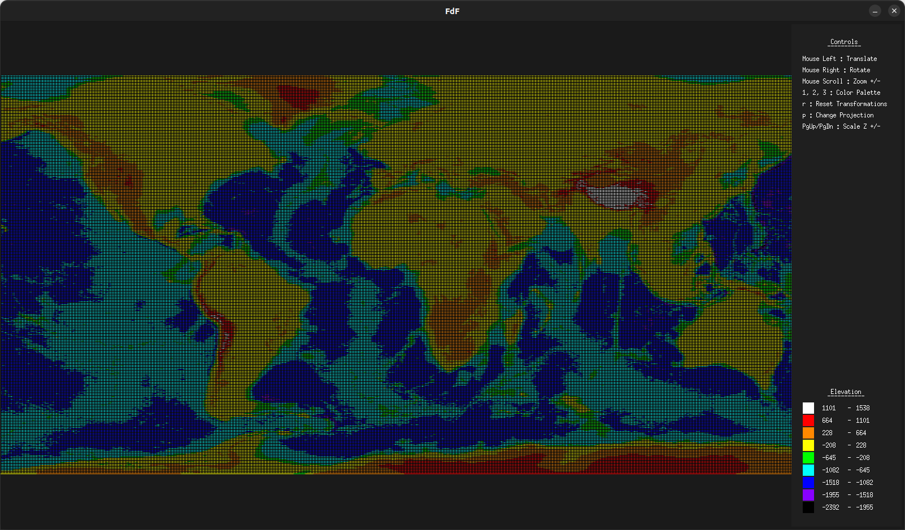

# FdF

Our initial dive into graphics programming, visualizing elevation maps through 3D wireframe rendering.

## Overview

## Build

### Dependencies

- [MinilibX](https://github.com/42Paris/minilibx-linux)  
`git clone https://github.com/42Paris/minilibx-linux.git lib/minilibx-linux`

### Compile

- `make all`

## Usage

`./fdf assets/maps/file.fdf`

### Controls

Shortcut | Action
:---: | ---
`Mouse Left` | Translate
`Mouse Right` | Rotate
`Mouse Scroll` | Zoom +/-
`PgUp`, `PgDn` | Z scaling +/-
`p` | Switch isometric/orthogonal projection
`r` | Reset transformations
`1`, `2`, `3` | Change color palette
`Esc` | Quit

## TODO

### mandatory
- set default scale.z value based on (z_max - z_min)
- set default scale factor based on (z_max - z_min)

### optional
- add option to decouple z-scaling and overall scaling when using mouse scroll
- fix black grid being rendered when using ortho projection -> draw pixels or rects instead of lines ?
- add option to plot triangles instead of quads
- use painter's algorithm <- compute polygon avg z value <- store transformed vertices

### optimization
- pass by reference instead of value for larger structs 
- replace calloc by arena_alloc